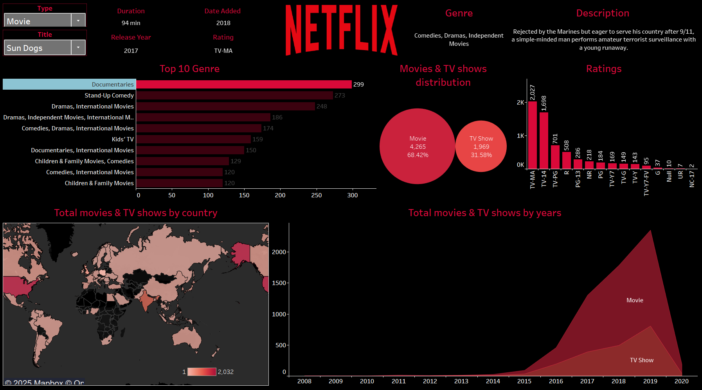

# 📺 Netflix Interactive Dashboard

## 🔍 Introduction

This project is an **interactive data visualization dashboard** built using **Tableau** that explores the Netflix catalog from a dataset of movies and TV shows available on the platform.

Link to the interactive dashboard : https://public.tableau.com/views/Netflix-Interactive-Dash/Netflix?:language=en-US&publish=yes&:sid=&:redirect=auth&:display_count=n&:origin=viz_share_link
---


## 📍 Netflix Dashboard Preview


```

```

---

## 💡 What This Dashboard Answers

| ❓ Question | ✅ These questions are **answered visually** in the dashboard.

1) What are the most common genres on Netflix?
| [Top 10 Genre Bar Chart](10-Genre-Bar.png)

2) Are there more movies or TV shows?
| [Pie Chart: Movie vs TV Show](Pie-Chart.png)

3) Which countries have the most Netflix content?
| [World Map: Titles by Country](World-Map.png)

4) What content ratings are most frequent?
| [Ratings Distribution Bar Chart](Ratings-Distribution.png)

5) How has content availability changed over time?
| [Area Chart by Year](Area-Chart.png)

6) What are the details of a specific movie/show?
| [Title Info Panel](Title-Info-Panel-1.png)
| [Title Info Panel](Title-Info-Panel-2.png)

---

## 📁 Project Files

| File                            | Description                                          |
| ------------------------------- | ---------------------------------------------------- |
| `Netflix-Interactive-Dash.twbx` | Tableau packaged workbook (open directly in Tableau) |
| `netflix_titles.csv`            | The original Netflix dataset from Kaggle             |
| `netflix-logo.jpg`              | Netflix branding for use in dashboard                |
| `Dash.png`                      | Static image of the dashboard                        |
| `README.md`                     | This guide                                           |

---

## 🚀 How to Use

### 🔹 **Option 1: Online (Tableau Public)**

_(if uploaded there)_  
Visit the public link and explore directly in your browser.

### 🔹 **Option 2: Desktop (Tableau Public)**

1. Download [Tableau Public](https://public.tableau.com/en-us/s/download)
2. Open `Netflix-Interactive-Dash.twbx`
3. Use filters to explore:
   - Type of content (Movie/TV Show)
   - Specific title info
   - Ratings, countries, genres, and more

---

## 📊 Key Dashboard Features

- **Interactive Filters**: Select by type, title, or segment
- **Genre & Rating Analysis**: Top 10 genres, bar chart of content ratings
- **Country Map**: See where the content is available
- **Time Trends**: Explore growth of Netflix content over the years
- **Title-Level Details**: See release year, rating, description, and duration

---

## 🛠️ Built With

- Tableau Desktop / Tableau Public
- Dataset: [`netflix_titles.csv`](https://www.kaggle.com/datasets/shivamb/netflix-shows)

---

## 👤 For Whom?

- Netflix viewers curious about content trends
- Students learning data visualization
- Analysts building dashboard design skills
- Anyone exploring storytelling with data

---

## 📬 Feedback

Feel free to open an issue or submit a pull request if you have ideas for improvements or want to contribute.
